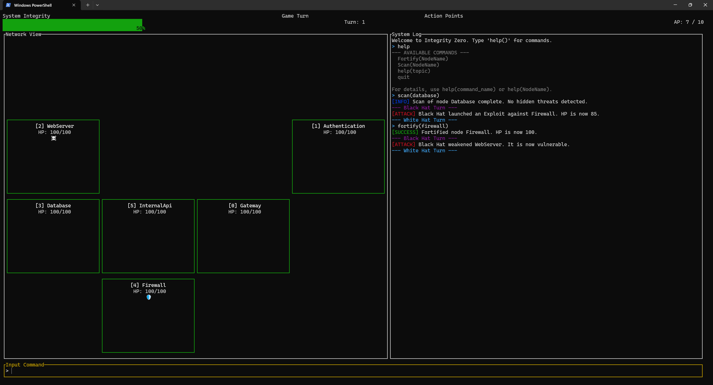

# Integrity Zero



**Integrity Zero** is a turn-based strategy game that runs entirely in your terminal. As a White Hat cybersecurity operator, your mission is to protect a critical computer network from a relentless AI hacker, the Black Hat.

Built with Rust and the [`ratatui`](https://ratatui.rs/) library, this project is a love letter to classic terminal interfaces and strategic gameplay. It's designed to be a learning experience for those interested in Rust, game development, and cybersecurity concepts, all wrapped in a fun and challenging package.

[](https://opensource.org/licenses/MIT)
[](https://www.rust-lang.org/)
[]

---

## Features

-   **Strategic Turn-Based Gameplay:** Manage your Action Points (AP) each turn to execute commands, repair nodes, and scan for threats.
-   **Procedurally Generated Networks:** Every game features a new, randomly generated network map, ensuring high replayability.
-   **Immersive Terminal UI:** A clean, retro-style interface built with `ratatui` that puts you in the command chair.
-   **Command-Based Interaction:** Type commands like `Fortify(Database)` to interact with the game, introducing players to a programming-like syntax.
-   **Dynamic AI Opponent:** The Black Hat's threat level grows over time, launching progressively more dangerous attacks like `Exploit`, `DDoS`, and `SQL_Injection`.
-   **In-Game Help System:** A built-in `help()` command provides all the information you need to play, right from the terminal.

---

## Getting Started

### Prerequisites

To build and run Integrity Zero, you will need the Rust toolchain installed on your system. You can install it via [rustup](https://rustup.rs/).

-   Rust (latest stable version)
-   Cargo (included with Rust)

### Installation & Running

1.  **Clone the repository:**
    ```bash
    git clone https://github.com/your-username/integrity-zero.git
    cd integrity-zero
    ```
    *(Replace `your-username` with your actual GitHub username)*

2.  **Build the project:**
    Cargo will automatically download all the necessary dependencies (`ratatui`, `crossterm`, etc.) and compile the project.
    ```bash
    cargo build --release
    ```
    *(Using the `--release` flag is recommended for a smoother gameplay experience, as it enables optimizations.)*

3.  **Run the game:**
    ```bash
    cargo run --release
    ```
    Alternatively, you can run the compiled binary directly:
    ```bash
    ./target/release/integrity-zero
    ```

---

## How to Play

### The Goal

Your primary objective is to achieve **100% System Integrity** before the Black Hat AI can bring it down to **0%**.

### The Interface

The screen is divided into four main sections:
1.  **Status Bar (Top):** Shows your global System Integrity, available Action Points (AP) for the current turn, and the turn counter.
2.  **Network View (Left):** A visual representation of the network grid. Each box is a **Node** with its name, health (HP), and status effects (e.g., 🛡️ for Shielded, ☠️ for Vulnerable). The border color of a node indicates its health (Green > Yellow > Red).
3.  **System Log (Right):** A color-coded, scrolling log of all actions taken by you (Cyan) and the Black Hat (Red/Magenta). This is your main source of information.
4.  **Input Bar (Bottom):** Your command line. Type your commands here and press `Enter`. The yellow border indicates it's your turn to act.

### Core Commands

-   `Fortify(NodeName)`: Repairs a node and applies a temporary Shield.
-   `Scan(NodeName)`: Scans a node for hidden threats.
-   `help()`: Displays a list of available commands.
-   `help(CommandName)`: Shows detailed information about a specific command.
-   `help(NodeName)`: Provides details on a specific node's properties.
-   `quit` or `q`: Exits the game.

### Gameplay Flow

1.  Start your turn with a fresh budget of **10 AP**.
2.  Assess the state of the network. Check the System Log for the AI's last actions.
3.  Type commands into the Input Bar to spend your AP.
4.  Once you execute an action that consumes AP, the Black Hat immediately takes its turn.
5.  The cycle repeats. Plan your moves carefully to outmaneuver the AI!

---

## License

This project is licensed under the MIT License - see the [LICENSE](LICENSE) file for details.